# Atlas AI RAG Financial Showcase

<p align="center">
  
  
  
  
  
  
  
  
  
</p>

This tutorial walks through a practical, production-oriented financial RAG system.  
The focus is learning by building: document ingestion, chunking, embeddings, retrieval, LLM answering, guardrails, and cost control.

> This repository is optimized for learning and portfolio demonstration.  
> It is not a one-click production template, but a transparent architecture you can inspect end-to-end.

## Target Audience

Engineers and builders who want a real-world example of:
- financial document ingestion
- RAG query workflows
- metrics extraction and earnings analysis
- FinOps-aware AI operations

## Project Details

- Stack: FastAPI, React, PostgreSQL + pgvector, Anthropic/OpenAI/Ollama
- Focus: RAG on financial filings (10-Q style documents)
- Objective: grounded answers with traceability, low hallucination risk, and cost visibility

## Navigation

- [Manual View](#manual-view)

<details open>
  <summary><strong>User Journey</strong></summary>

  - [Query Flow](#query-flow)
  - [Query Cache and Cost Saving](#query-cache-and-cost-saving)
  - [Documents](#documents)
  - [Data Ingestion](#data-ingestion)
  - [RAG Query Execution](#rag-query-execution)
  - [Earnings Signals](#earnings-signals)
  - [Cost and Usage](#cost-and-usage)
  - [Audit](#audit)
  - [Cost Trade-offs](#cost-trade-offs)
  - [Multi-Layer Protection](#multi-layer-protection-cost-and-reliability)
</details>

<details open>
  <summary><strong>Architecture and Data</strong></summary>

  - [Selected Architecture](#selected-architecture)
  - [SQL Diagnostics (Chunks / Embeddings / Tokens)](#sql-diagnostics-chunks-embeddings-and-token-estimates)
  - [Terraform Rollout (Final Delivery)](#terraform-rollout-final-delivery)
</details>

<details open>
  <summary><strong>Decisions and References</strong></summary>

  - [ADR-002: API Gateway + VPC Link](#adr-002-api-gateway--vpc-link)
  - [Data Sources](#data-sources)
</details>

## Manual View

This is the complete operator manual screen of the showcase, with all key sections available from one interface.

- documents and ingestion workflows
- query execution and evidence display
- earnings signals, cost usage, and audit visibility
- architecture and trade-off context for technical decisions

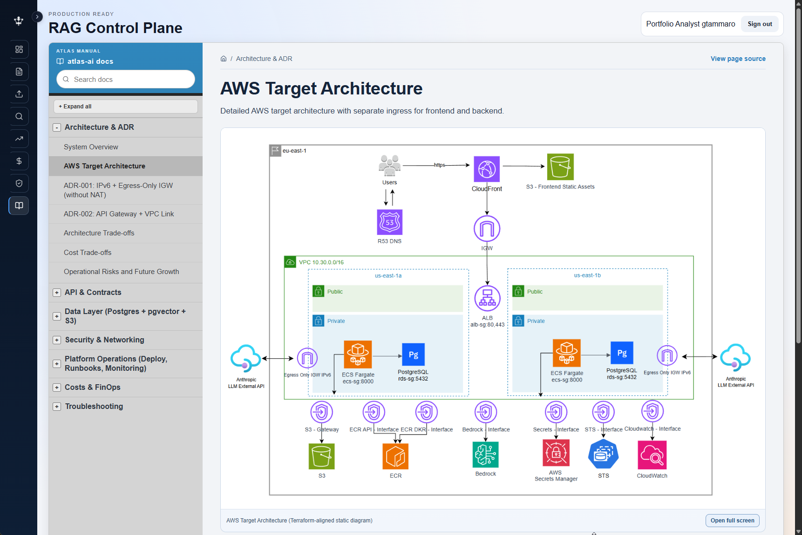

## Query Flow

This is the main entry point of the system.  
The user first ingests documents, then submits a question, and the backend returns a grounded answer with evidence from retrieved chunks.

Flow:
1. user ingests data (upload documents -> chunking -> embeddings in pgvector)
2. user writes the query in the Query panel (step 2 in the UI flow)
3. system returns the answer and attached evidence chunks
4. by default, retrieval is `top-k = 10`, so the response is grounded on **10 chunks**

Practical note:
- `top_k` default is set to `10` in backend settings, and query runs track retrieval depth.
- at the top of the dashboard, you can also see query cost signals (token usage and estimated cost).

Traceability example (TCL):
1. user asks for **Total Current Liabilities (TCL)** after ingestion.
2. system returns the value **162,367** (in millions).
3. evidence snippet shown in the UI: [Total Current Liabilities Extract](docs/images/total_current_liabilities.png).
4. source filing PDF (repo file): [aapl-20251227.pdf](docs/10Q_PDF/aapl-20251227.pdf).
5. the value is read from the balance sheet line `Total current liabilities`.

### PDF Extract Example

Total current liabilities is shown through an extracted snippet from a source filing PDF.  
It demonstrates that the query answer can be traced to original document evidence.

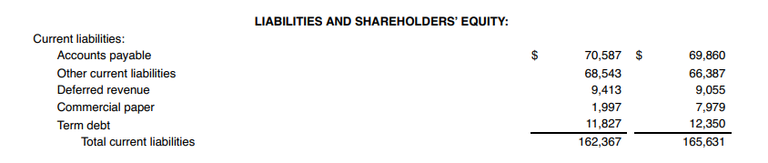

Cache-hit cost behavior (visible in the top metrics/cards):
- if the same normalized query is served from cache (`served_from_cache=true`), no new LLM call is executed
- the incremental query cost is **0** for that run (`actual_cost_usd = 0`)
- this is why you can see a **zero-cost query** even when an answer is returned

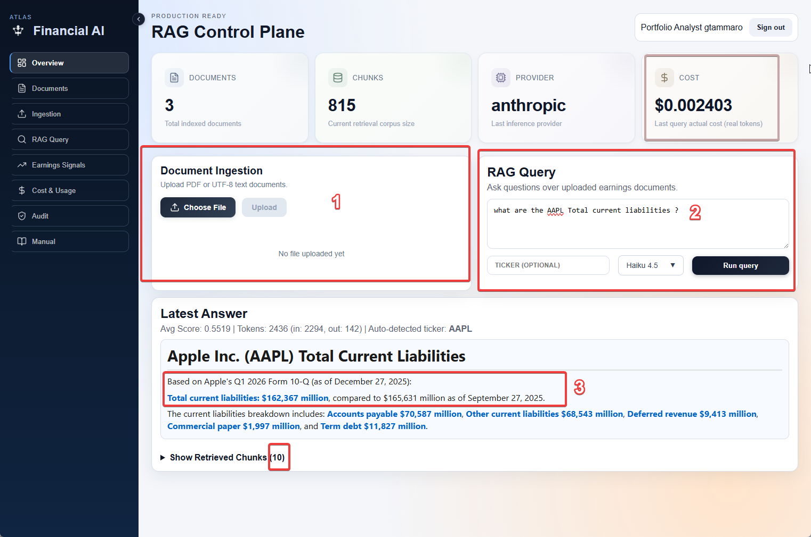

## Query Cache and Cost Saving

When the same normalized query is repeated with the same parameters, the system serves the response from internal cache instead of triggering a new provider call.

Why it matters:
- lower latency for repeated requests
- lower token usage and lower cost
- consistent answer for identical query inputs

Cache behavior:
1. check query signature (query + ticker + model + top-k)
2. cache hit -> return cached answer
3. cache miss -> run retrieval + LLM, then persist

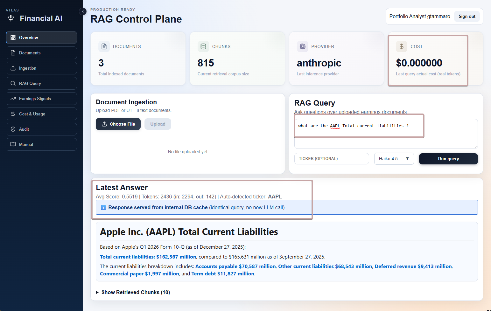

## Documents

This stage is where uploaded files are listed, reviewed, and selected before running deeper processing workflows.

What this view enables:
- inspect available documents in the local corpus
- verify filenames and uploaded assets
- prepare the document set that will be ingested and queried

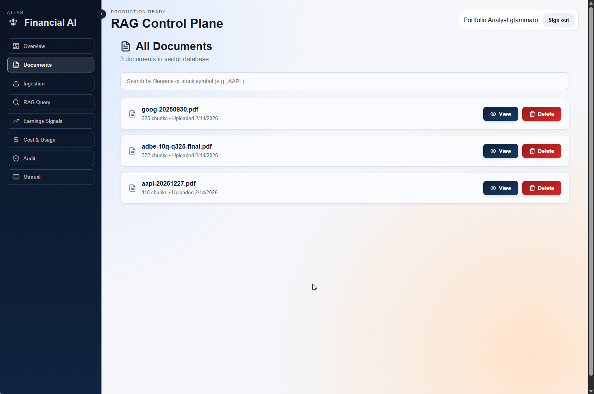

## Data Ingestion

This step shows how documents enter the RAG pipeline.

Ingestion flow:
1. upload PDF or UTF-8 text document
2. extract and normalize text
3. split text into chunks
4. generate embeddings for each chunk
5. store documents/chunks/vectors in PostgreSQL + pgvector

Result:
- searchable knowledge base ready for semantic retrieval
- traceability from answer to source chunks

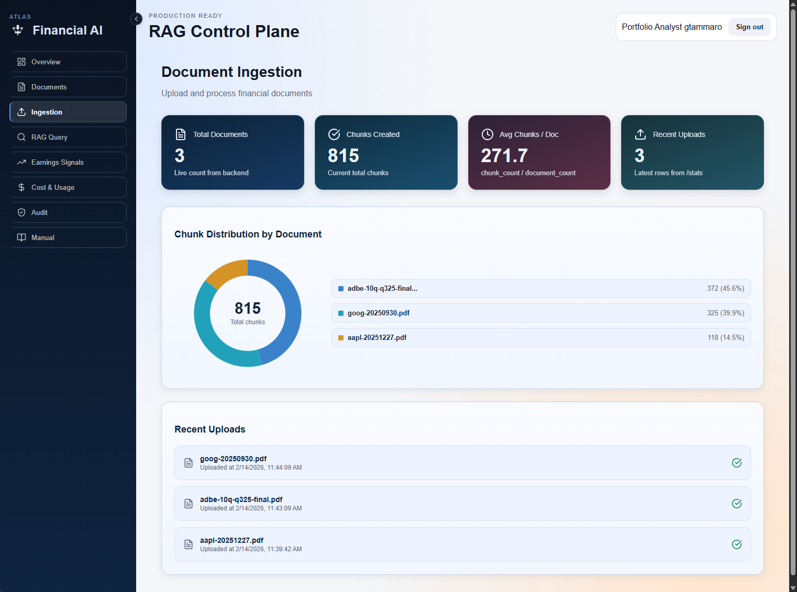

## RAG Query Execution

This view represents runtime query execution after ingestion.

Execution path:
1. user asks a financial question
2. backend retrieves top relevant chunks
3. model composes a grounded answer
4. UI shows score, token usage, and evidence chunks


## Earnings Signals

This section focuses on extracted financial signals from filings.

What it highlights:
- key earnings indicators for selected tickers
- normalized values for analysis
- fast review panel for portfolio-style questions

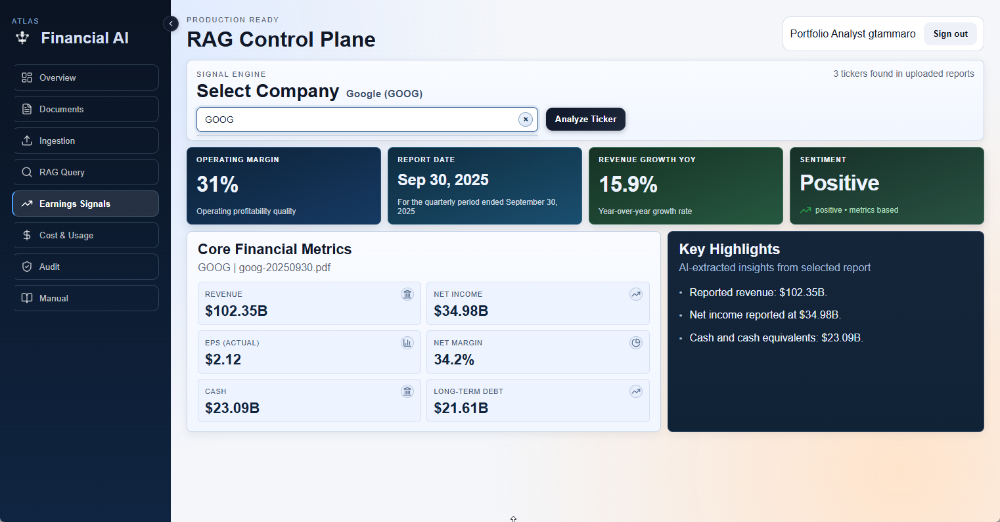

## Cost and Usage

This dashboard tracks operational cost behavior of the RAG platform.

Main purpose:
- monitor volume and spend trend
- verify cache impact vs fresh calls
- keep usage visible for FinOps decisions

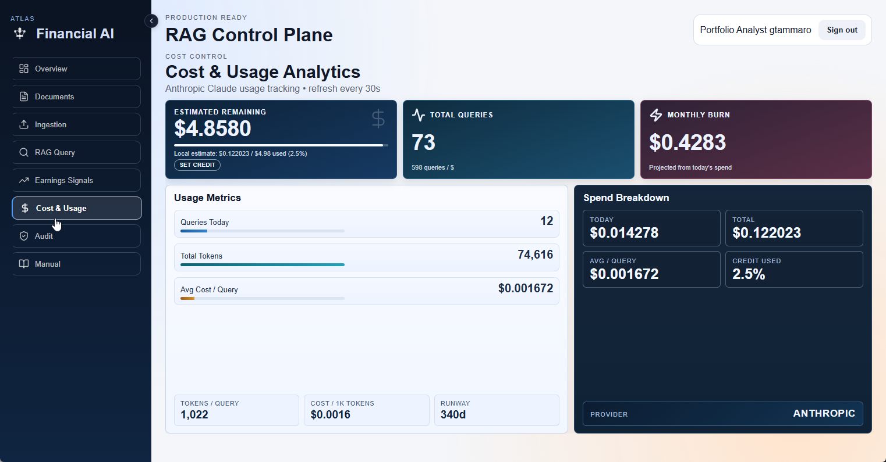

## Audit

The Audit view is the operational trace layer.

What it is used for:
- inspect recent query executions
- verify provider, retrieval depth, and token behavior
- detect anomalies or repeated failures
- support post-incident analysis with concrete evidence

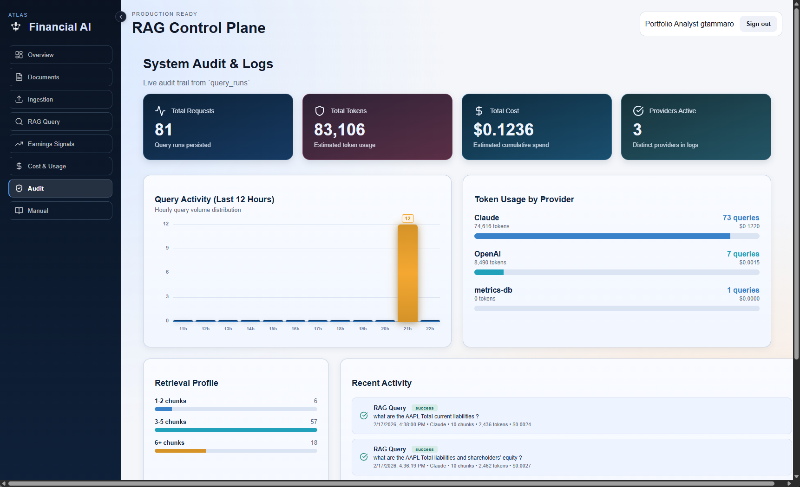

## Cost Trade-offs

This view explains architecture trade-offs behind infrastructure and AI spending.

Trade-off dimensions:
- security boundary vs fixed monthly cost
- performance/latency vs token and compute cost
- richer retrieval context vs higher inference spend
- operational simplicity vs fine-grained control

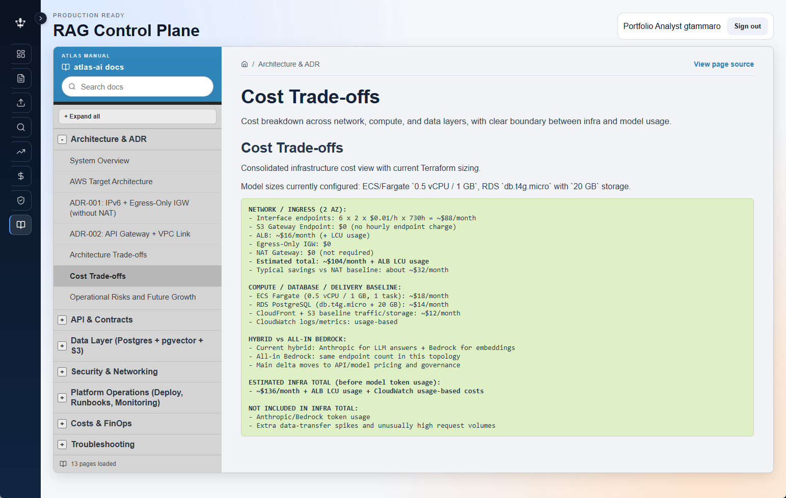

## Multi-Layer Protection (Cost and Reliability)

This project applies 8 protection layers to reduce runaway behavior, control spend, and improve reliability.

| # | Layer | Protection | Prevents |
|---|-------|------------|----------|
| 1 | Max Retries | Hard retry limit | Infinite retry loops |
| 2 | Circuit Breaker | Stop after repeated failures | Cascading failures |
| 3 | Cost Budget | Daily and hourly budget controls | Budget drain |
| 4 | Timeout | Maximum wait between retries | Hanging requests |
| 5 | Request Deduplication | Reuse identical requests when possible | Duplicate queries and duplicate cost |
| 6 | Loading State Control | Block repeated actions while processing | Double-click execution |
| 7 | Client Rate Limit | Sliding-window request cap | Spam bursts |
| 8 | Abort Control | Cancel superseded or obsolete runs | Orphan requests |

## Selected Architecture

We selected `CloudFront + S3 + ALB + ECS Fargate + PostgreSQL (pgvector)` because it gives the best balance between reliability, security, and cost for a portfolio-grade production pattern.

Why this choice:
- frontend delivery stays fast and low-cost with CloudFront + S3
- API traffic is controlled through ALB instead of exposing app containers directly
- backend compute runs isolated on Fargate
- `PostgreSQL` stores structured operational data (documents, metadata, audit, cache, usage)
- `pgvector` enables semantic search over embeddings for accurate RAG retrieval
- this keeps the system maintainable while avoiding over-complex enterprise-only patterns

### Why We Chose PGVector (Small Cap / Startup Focus)

We selected `PostgreSQL + pgvector` because this project targets **small-cap and startup workloads** where:

- team size is small and platform complexity must stay low
- budget discipline matters more than hyperscale throughput
- one data platform for relational + vector data reduces ops overhead
- SQL joins, transactions, backup, and auditability are needed from day one

In short: pgvector gives enough semantic search power without introducing an extra distributed vector stack too early.

### PGVector Capacity Envelope for This Architecture

These are **practical operating ranges** for this project pattern (single primary Postgres on AWS, private ECS backend, HNSW/IVFFlat tuning as needed):

| Stage | Approx vector rows (chunks) | Practical status |
|---|---|---|
| Early | up to `500k` | Very comfortable with pgvector for startup workloads |
| Growth | `500k` to `5M` | Still a strong fit with proper indexing and DB sizing |
| Upper stretch | `5M` to `10M` | Feasible, but needs stricter tuning (memory, vacuum, partitions, index management) |
| Re-architecture zone | `>10M` | Re-evaluate architecture (sharding, read replicas, or specialized vector engine) |

Query/load guidance for this showcase profile:

- target latency budget: interactive dashboard queries with tuned `top-k`
- sustained high concurrency (`>100 QPS` semantic queries) is usually the point to reassess architecture
- aggressive multi-tenant isolation + very large corpora is another trigger to move beyond single-node pgvector

### PGVector Technical Limits (Important)

Official indexable type limits (from pgvector):

- `vector`: up to `2,000` dimensions for ANN indexing
- `halfvec`: up to `4,000` dimensions for ANN indexing
- `bit`: up to `64,000` dimensions for ANN indexing
- `sparsevec`: up to `1,000` non-zero elements for ANN indexing

Storage-size rule of thumb:

- `vector` storage is `4 * dimensions + 8` bytes per row
- example: `1536` dims is about `6.1 KB` per vector row before additional table/index overhead

This is why PGVector is excellent for our current stage, but not infinite:

- as vectors and QPS grow, index memory and maintenance cost increase materially
- beyond the upper stretch range, cost/performance tuning effort can exceed startup benefits

### SQL Diagnostics (Chunks, Embeddings, and Token Estimates)

Use these SQL checks to inspect real corpus scale and keep capacity decisions data-driven.

Key interpretation:

- in this ingestion flow, **1 chunk = 1 embedding row**
- if chunks are `0`, embeddings are also `0`
- `query_runs.total_tokens` is **LLM token usage** (`input + output`), not embedding count

#### 1. Corpus size: chunks vs embeddings

```sql
SELECT
  COUNT(*) AS chunks_total,
  COUNT(*) FILTER (WHERE embedding IS NOT NULL) AS embeddings_total
FROM chunks;
```

#### 2. Per-document chunk volume and estimated tokens/chunk

```sql
SELECT
  d.id,
  d.filename,
  COUNT(c.id) AS chunk_count,
  ROUND(AVG(length(c.content))::numeric, 0) AS avg_chars_per_chunk,
  ROUND((AVG(length(c.content)) / 4.0)::numeric, 0) AS est_avg_tokens_per_chunk
FROM documents d
LEFT JOIN chunks c ON c.document_id = d.id
GROUP BY d.id, d.filename
ORDER BY chunk_count DESC, d.id DESC;
```

#### 3. Estimated corpus token mass (embedding-input estimate)

```sql
SELECT
  COUNT(*) AS chunks_total,
  COALESCE(SUM(length(content)), 0) AS total_chars,
  ROUND((COALESCE(SUM(length(content)), 0) / 4.0)::numeric, 0) AS est_total_tokens
FROM chunks;
```

#### 4. Approximate raw vector payload size in memory/storage terms

```sql
SELECT
  COUNT(*) AS embeddings_total,
  MIN(vector_dims(embedding)) AS dims_min,
  MAX(vector_dims(embedding)) AS dims_max,
  (4 * MIN(vector_dims(embedding)) + 8) AS approx_bytes_per_embedding,
  ROUND(
    (COUNT(*) * (4 * MIN(vector_dims(embedding)) + 8) / 1024.0 / 1024.0)::numeric,
    2
  ) AS approx_vector_payload_mb
FROM chunks;
```

#### 5. Real PostgreSQL table/index footprint for chunks

```sql
SELECT
  pg_size_pretty(pg_relation_size('chunks')) AS chunks_table_size,
  pg_size_pretty(pg_indexes_size('chunks')) AS chunks_indexes_size,
  pg_size_pretty(pg_total_relation_size('chunks')) AS chunks_total_size;
```

#### 6. LLM token usage from query runs (not embeddings)

```sql
SELECT
  COUNT(*) AS query_runs,
  COALESCE(SUM(input_tokens), 0) AS input_tokens_total,
  COALESCE(SUM(output_tokens), 0) AS output_tokens_total,
  COALESCE(SUM(estimated_tokens), 0) AS total_tokens,
  COALESCE(ROUND(AVG(estimated_tokens)::numeric, 2), 0) AS avg_tokens_per_query
FROM query_runs;
```

Token note:

- `chars / 4` is a practical estimate, not exact billing tokenization
- for precise billing/forecasting, use provider tokenizer outputs and live usage logs

### How the Architecture Is Built

The system is organized in five logical layers:

1. **Presentation layer**
   - React frontend is served through `S3 + CloudFront`.
   - Users interact with dashboard pages for query, ingestion, earnings, cost, and audit.
2. **Ingress layer**
   - Traffic enters through `ALB`, which is the single entry point for backend APIs in this phase.
3. **Application layer**
   - `FastAPI` runs on `ECS Fargate` and orchestrates ingestion, retrieval, provider routing, and response composition.
4. **Data layer**
   - `PostgreSQL` stores documents, chunks, metadata, usage, and audit records.
   - `pgvector` stores embeddings for semantic similarity search.
   - `S3` stores source filing documents (PDF/text) used as ground truth.
5. **Control and observability layer**
   - `Secrets Manager` handles runtime secrets.
   - `CloudWatch Logs` captures operational telemetry.
   - `STS` and VPC endpoints keep runtime access controlled in private networking patterns.

### VPC Endpoint Strategy (7 total: 6 Interface + 1 Gateway)

To keep ECS tasks private and reduce unnecessary public internet dependencies for AWS service traffic, this architecture uses:

- **6 Interface Endpoints**
- **1 Gateway Endpoint**

Endpoint set:

| # | Endpoint Type | AWS Service | Why It Exists in This Architecture |
|---|---|---|---|
| 1 | Interface | `ECR API` | ECS needs private access to image metadata and auth flow before pull |
| 2 | Interface | `ECR DKR` | ECS needs private Docker registry access during image pull |
| 3 | Interface | `CloudWatch Logs` | Backend and ECS runtime logs are shipped without public egress |
| 4 | Interface | `Secrets Manager` | Runtime secrets are fetched privately at startup and during execution |
| 5 | Interface | `STS` | Task role credential flows stay private |
| 6 | Interface | `Bedrock Runtime` | Embeddings path (`EMBEDDING_MODE=bedrock`) stays private |
| 7 | Gateway | `S3` | Image layers and S3 document traffic can traverse private VPC routing |

**Summary:**
- **7 total endpoints = 6 Interface + 1 Gateway**
- this is the minimum practical baseline for the current private ECS + RAG runtime pattern.
- **NAT Gateway is intentionally not used** in this deployment to avoid fixed monthly NAT cost.

### IPv6 Egress Decision in This Deployment

As of **February 17, 2026**, practical DNS checks show:

- `api.anthropic.com` publishes an `AAAA` record (IPv6 reachable)
- `api.openai.com` currently resolves to `A` records only (no `AAAA` record observed)

For this architecture, the decision is explicit:

1. We keep backend Python on `ECS Fargate` in **private subnets**.
2. We avoid `NAT Gateway` cost in this baseline.
3. We use `Bedrock Runtime` (private Interface Endpoint) for embeddings.
4. We use Anthropic API key for external LLM queries, routed through IPv6 egress (`Egress-Only IGW`).
5. We do **not** use OpenAI for live query execution in this deployment.

Why OpenAI is not used here:

- `api.openai.com` requires an IPv4 egress path in practice.
- With private ECS and no NAT/IPv4 proxy, OpenAI requests can fail at network egress.

Important boundary clarification:

- `PostgreSQL + pgvector` is a private data layer and does not perform outbound internet calls.
- Outbound LLM/API traffic is made by the Python backend running on ECS Fargate.

### End-to-End Query Path

1. user sends a financial question from the frontend
2. request reaches FastAPI backend through ALB
3. backend retrieves top-k relevant chunks from PostgreSQL + pgvector
4. backend calls the selected model provider with grounded context
5. response, evidence, and usage metadata are returned to UI and logged for audit/cost analysis

### Why `top-k = 10` and not `3`

Financial answers usually need evidence spread across multiple pages and sections.

With `top-k=3`, recall often drops; with `top-k=10`, context coverage is safer for grounded answers.

- **`k=3`: cheaper, but higher risk of missing key evidence.**
- **`k=10`: better recall with an acceptable token increase.**
- **Start with `10`, then tune using real evaluation data (`quality`, `latency`, `cost/query`).**

### Python Backend Outbound Calls (Chronological Flow)

This is the practical runtime sequence for external service calls from backend startup to live inference.

| Step | Source | Destination | Purpose | Exposure |
|---|---|---|---|---|
| 1 | ECS task startup | ECR (Interface Endpoint) | Discover image metadata before pull | Private |
| 1.5 | ECR | ECS task startup | Return layer locations and pull tokens | Private |
| 2 | ECS task startup | S3 (Gateway Endpoint) | Download image layers required for container boot | Private |
| 3 | ECS/Fargate runtime | Task ephemeral disk | Materialize layers and start Python container | Internal |
| 4 | Python backend | Secrets Manager (Interface Endpoint) | Load runtime secrets and credentials | Private |
| 5 | Python backend | Anthropic API (`api.anthropic.com`) | Run live LLM inference for user queries | Controlled public egress (IPv6 path) |
| 6 | ECS + Python backend | CloudWatch Logs (Interface Endpoint) | Persist operational logs and diagnostics | Private |
| 7 | ECS + Python backend | STS (Interface Endpoint) | Obtain temporary AWS credentials | Private |
| 8 | Python backend | Bedrock Runtime (Interface Endpoint) | Generate embeddings through private AWS path (`EMBEDDING_MODE=bedrock`) | Private |

**Data boundary recap:**
- **S3 stores source filing documents (PDFs).**
- **PostgreSQL + pgvector stores extracted text, chunks, embeddings, and retrieval metadata.**

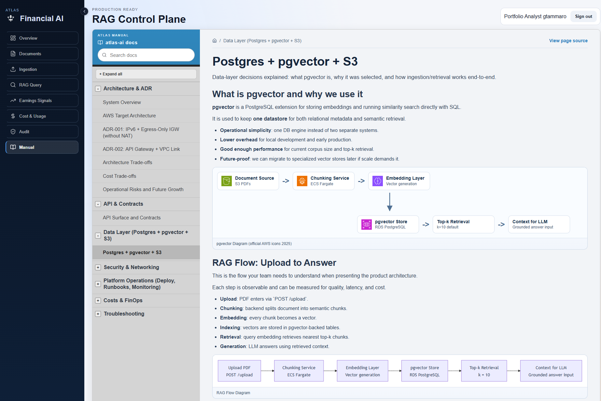

### Terraform Rollout (Final Delivery)


Final delivery is **Terraform-driven**, not manual click-by-click provisioning.

Terraform template highlights (most relevant):
- `Egress-Only Internet Gateway` for IPv6 outbound traffic from private subnets
- **No NAT Gateway** in the baseline (cost-saving design choice)
- ECS Fargate tasks in private subnets (`assign_public_ip=false`)
- ALB as controlled ingress, spread across 2 AZ
- VPC endpoint baseline: **7 total** (`6 Interface + 1 Gateway`)
- `bedrock-runtime` Interface Endpoint for private embeddings path
- `S3` Gateway Endpoint for private S3 routing

What this means operationally:
1. networking, compute, storage, and data services are provisioned with Terraform templates
2. environment changes are applied through versioned IaC updates
3. backend/frontend rollout happens on top of that Terraform baseline
4. the final production path is repeatable because infrastructure state is codified

Practical conclusion:
- at the end of the project flow, we push infrastructure changes through Terraform as the canonical deployment path
- this avoids drift and keeps architecture, cost controls, and security settings consistent across environments

## ADR-002: API Gateway + VPC Link


**Decision:** API Gateway + VPC Link is intentionally deferred in this phase.  
**Current baseline:** ALB + private ECS already meets security, delivery speed, and cost discipline targets.

| Decision Area | Current Choice (Now) | API Gateway + VPC Link (Later) | Why Deferred |
|---|---|---|---|
| Product shape | Single internal dashboard | External API product for partners/clients | We do not need public developer APIs yet |
| Access model | Cognito + backend auth validation | Per-tenant API keys, usage plans, API products | Tenant API governance is not required yet |
| Rate and quotas | App-level controls + backend protections | Central API throttling and quota plans | Existing controls are sufficient for current load |
| Ops complexity | One ingress layer (ALB) | Additional routing, policies, contracts | Extra moving parts with limited immediate value |
| Cost profile | Lean baseline for fast iteration | Higher fixed and operational overhead | Current priority is cost discipline and shipping speed |

### When We Will Introduce API Gateway

- external client/partner APIs become a core product surface
- per-tenant API keys and usage plans become mandatory
- strict per-route governance and monetization controls are needed
- multi-team API lifecycle management requires centralized enforcement

## Data Sources

The showcase uses public financial filing documents that can be downloaded freely online.  
Those documents are ingested, chunked, embedded, and used as evidence for answers shown in this portfolio.
